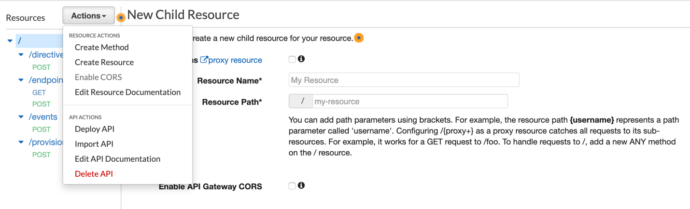
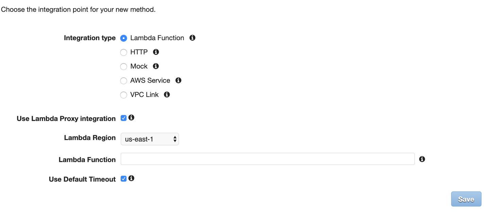
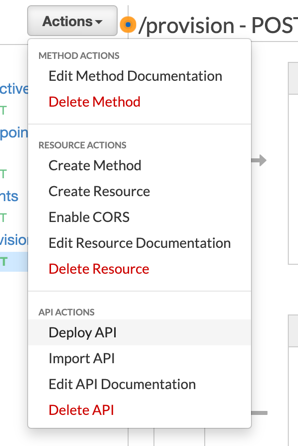

### Implement SDAE Event

The moment the device gets provisioned through the Amazon Device Setup Service,
it will connect immediately to the customer local wifi network. And the device
will have set of data elements of the provisioning session that would be
required to complete the next steps of setting up the device. The elements are:

1.  The session token created for device during WSS provisioning session, with format: 
amzn1.ffs.wss-wifi-session-tokeamzn1.ffs.wss-wifi-session-toke.xxxx 

2.  The signature of the session token, which is an encrypted session token
    using the private key of the device.

3.  Device Identifier.

The next step is to notify Amazon Alexa service through Skill Device Association
Event that there is a new device that has been provisioned through Wi-Fi Simple
Setup and include the above fields for identifying the device.

This section will introduce the changes that needs to be applied to the
smarthome-sandbox backend lambda in order to support the flow of SDAE:

1.  Create a new resource /provision: Navigate to API Gateway \> Endpoint Cloud
    \> Resources

2.  Click Actions \> Create Resource and put “provision” in both Resource Name
    and Resource Path and then Click Create Resource.

    

3.  Select the newly created resource and Click Actions \> Create Method and
    then Select POST.

>   Make sure that “Use Lambda proxy integration” is checked and you can
>   specifcy the correct ARN of the skill lambda that has been created when you
>   deployed the stack for smart-home sandbox skill.

1.  Once you’re ready you can deploy the changes to the API gateway.

    

2.  Change the backend Lambda: You can replace the following set of files inside
    the endpoint cloud lambda:

    lambda/api/endpoint_cloud/api_handler_directive.py

    lambda/api/endpoint_cloud/api_handler_endpoint.py

    lambda/api/endpoint_cloud/api_handler_event.py

    lambda/api/index.py

3.  Review and save the changes to the lambda.

[Next>>](Task-API002.md)
