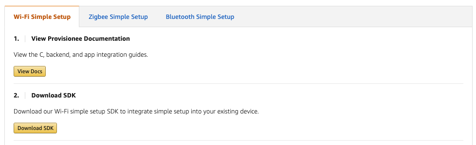

Download and Run WSS C SDK
--------------------------

### Download the SDK

The SDK can be downloaded from the [Frustration-Free Setup developer
console](https://developer.amazon.com/frustration-free-setup/console/wifi) as a
zip file. You can unzip the file in a folder of your choice. This document will
assume that the folder you extracted the sdk in is \$ffs

### Using the SDK

The WSS SDK relies on the following libraries on the platform you’re running:

**gtest:**

You can use the following to install gtest into your platform:

~~~~~~~~~~~~~~~~~~~~~~~~~~~~~~~~~~~~~~~~~~~~~~~~~~~~~~~~~~~~~~~~~~~~~~~~~~~~~~~~
git clone https://github.com/google/googletest
cd googletest
mkdir build
cd build
cmake ..
make
make install
~~~~~~~~~~~~~~~~~~~~~~~~~~~~~~~~~~~~~~~~~~~~~~~~~~~~~~~~~~~~~~~~~~~~~~~~~~~~~~~~

**Openssl:**

Usually you would find Openssl installed, so you might need to only verify and
know the location that openssl include and lib folders are located. You can use
the following command to make sure that the variables used by SDK are set
correctly:

~~~~~~~~~~~~~~~~~~~~~~~~~~~~~~~~~~~~~~~~~~~~~~~~~~~~~~~~~~~~~~~~~~~~~~~~~~~~~~~~
export OPENSSL_ROOT_DIR=$(/usr/bin/openssl)
export OPENSSL_LIBRARIES=$(/usr/bin/openssl/lib)
~~~~~~~~~~~~~~~~~~~~~~~~~~~~~~~~~~~~~~~~~~~~~~~~~~~~~~~~~~~~~~~~~~~~~~~~~~~~~~~~

\-- note command line stuck when running this. Fix the openSSL dependency issue
by running:

~~~~~~~~~~~~~~~~~~~~~~~~~~~~~~~~~~~~~~~~~~~~~~~~~~~~~~~~~~~~~~~~~~~~~~~~~~~~~~~~
cmake .. -DOPENSSL_ROOT_DIR=/usr/local/opt/openssl -DOPENSSL_LIBRARIES=/usr/local/opt/openssl/lib
~~~~~~~~~~~~~~~~~~~~~~~~~~~~~~~~~~~~~~~~~~~~~~~~~~~~~~~~~~~~~~~~~~~~~~~~~~~~~~~~

**Curl:**

This should be installed by default.

Make sure that the libraries are installed and know the location of them before
attempting to build the SDK.

### Building the FFS Library for testing and debugging:

The following are the steps to follow to create the build system and build and
install the FFS library:

1- The first Build is to build the system itself. Navigate to the path:
\$ffs/ffs-provisionee-sdk-master

And run the below command to run cmake:

~~~~~~~~~~~~~~~~~~~~~~~~~~~~~~~~~~~~~~~~~~~~~~~~~~~~~~~~~~~~~~~~~~~~~~~~~~~~~~~~
mkdir build
cd build
cmake ..
~~~~~~~~~~~~~~~~~~~~~~~~~~~~~~~~~~~~~~~~~~~~~~~~~~~~~~~~~~~~~~~~~~~~~~~~~~~~~~~~

2- You need to install the libraries to your system. while inside
\$ffs/ffs-provisionee-sdk-master/build you can run the following commnand to
install for all users:

sudo make install

3- You can run the tests created for verifying that the build is performed
properly (Need to finish 1 and 2 in this section first). you can run all tests
using the following command:

\$ffs/ffs-provisionee-sdk-master/libffs/test/all_tests （note: doesn't exist my
sdk)

### Building and Running the SDK demo:

The build system for the demo is through the directory ffs_linux. So you need to
be in the following path: "\$ffs/ffs-provisionee-sdk-master/ffs_linux"

You will notice that there is a separate CMakeLists.txt file. Run the following
commands

~~~~~~~~~~~~~~~~~~~~~~~~~~~~~~~~~~~~~~~~~~~~~~~~~~~~~~~~~~~~~~~~~~~~~~~~~~~~~~~~
mkdir build
cd build
cmake ..
~~~~~~~~~~~~~~~~~~~~~~~~~~~~~~~~~~~~~~~~~~~~~~~~~~~~~~~~~~~~~~~~~~~~~~~~~~~~~~~~

Navigate to the build directory, so you should be in the following path:
"\$ffs/ffs-provisionee-sdk-master/ffs_linux/build"

Run the following command:

~~~~~~~~~~~~~~~~~~~~~~~~~~~~~~~~~~~~~~~~~~~~~~~~~~~~~~~~~~~~~~~~~~~~~~~~~~~~~~~~
make
~~~~~~~~~~~~~~~~~~~~~~~~~~~~~~~~~~~~~~~~~~~~~~~~~~~~~~~~~~~~~~~~~~~~~~~~~~~~~~~~

Now you can run the demo while you're in the build directory with sudo
permission to allow for accessing all libraries by running the following
command:

~~~~~~~~~~~~~~~~~~~~~~~~~~~~~~~~~~~~~~~~~~~~~~~~~~~~~~~~~~~~~~~~~~~~~~~~~~~~~~~~
sudo ./FrustrationFreeSetupLinuxDemo
~~~~~~~~~~~~~~~~~~~~~~~~~~~~~~~~~~~~~~~~~~~~~~~~~~~~~~~~~~~~~~~~~~~~~~~~~~~~~~~~

**Note:**

The FrustrationFreeSetupLinuxDemo executable file loads the default demo keys
that comes with the sdk. To use different keys, you need to copy both the
certificate.pem and private_key.pem in the following folder:
\$ffs/ffs-provisionee-sdk-master/ffs_linux/libffs/data/device_certificate and
build the demo to make sure the new keys are included.

[Next\>\>](Task-SDK003.md)
