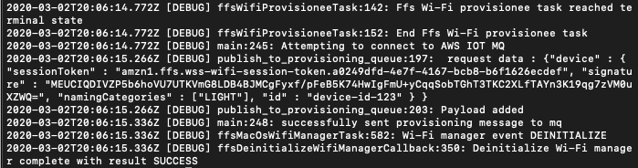

Build WSS SDK with AWS IoT for embedded C.
------------------------------------------

The following section walks you through using the WSS SDK with AWS IoT Embedded
C.

### Pre-requisites:

1- Download and install AWS IoT Device SDK for Embedded C. You can refer to the
following [User
Guide](https://docs.aws.amazon.com/iot/latest/developerguide/sdk-tutorials.html)
for more information. And copy the contents of AWSIoT SDK to
\$ffs-provisionee-sdk-master/ffs_linux/awsiot.

2- WSS SDK relies on CMake for creating the build system for the sdk, and for
the purpose of testing we have added AWS IoT for embedded linux and created a
CMake file to incorporate the wss sdk build along with AWS IoT libraries and
dependencies.

Copy and Replace the following files from this GitHub repository to the SDK you
downloaded in the previous [step](Task-SDK001.md):

~~~~~~~~~~~~~~~~~~~~~~~~~~~~~~~~~~~~~~~~~~~~~~~~~~~~~~~~~~~~~~~~~~~~~~~~~~~~~~~~
cp wss-workshop-sample-device/ffs-provisionee-sdk-master/ffs_linux/awsiot/CMakeLists.txt ${Your-base-folder}/ffs-provisionee-sdk-master/ffs_linux/awsiot/

cp wss-workshop-sample-device/ffs-provisionee-sdk-master/ffs_linux/libffs/src/ffs/linux/ffs_linux_workshop.c ${Your-base-folder}/ffs-provisionee-sdk-master/ffs_linux/libffs/src/ffs/linux/

cp wss-workshop-sample-device/fffs-provisionee-sdk-master/ffs_linux/CMakeLists.txt  ${Your-base-folder}/ffs-provisionee-sdk-master/ffs_linux/CMakeLists.txt
~~~~~~~~~~~~~~~~~~~~~~~~~~~~~~~~~~~~~~~~~~~~~~~~~~~~~~~~~~~~~~~~~~~~~~~~~~~~~~~~

 

The following is a summary of the list of files and changes you should be
applying to the SDK along with the configurations specific to AWS IoT SDK:

| File                                                                            | Description                                                                                                                                                                                                                      |
|---------------------------------------------------------------------------------|----------------------------------------------------------------------------------------------------------------------------------------------------------------------------------------------------------------------------------|
| ffs-provisionee-sdk-master/ffs_linux/awsiot/external_libs/mbedTLS               | Download and unzip the mbed TLS library in the external_libs folder of awsiot. For more details please refer to [Using AWS IoT Device SDK for Embedded C]                                                                        |
| ffs-provisionee-sdk-master/ffs_linux/awsiot/CMakeLists.txt                      | A Full cmake file that includes building a library aws_iot_embedded With all its dependencies.                                                                                                                                   |
| ffs-provisionee-sdk-master/ffs_linux/awsiot/certs                               | This directory should contain the keys and certificates required to connect to AWS IoT core.                                                                                                                                     |
| ffs-provisionee-sdk-master/ffs_linux/awsiot/ include/aws_iot_config.h           | This file should be updated to include the required configuration to connect to AWS IoT core. The main entries that need to be modified are AWS_IOT_MQTT_HOST, AWS_IOT_MQTT_PORT, AWS_IOT_MQTT_CLIENT_ID, AWS_IOT_MY_THING_NAME. |
| ffs-provisionee-sdk-master/ffs_linux/CMakeLists.txt                             | Modify the ffs_linux cmake file to include the details required for aws_iot_embedded along with its dependencies.                                                                                                                |
| ffs-provisionee-sdk-master/ffs_linux /libffs/src/ffs/linux/ffs_linux_workshop.c | A new file to leverage WSS SDK class to get provisioned through Amazon Setup service and then use AWS MQ libraries to send a provisioning message to MQ to complete the setup process of a device.                               |

 

### Building the combined SDKs:

The following are the list of steps to create the build system for running WSS
SDK with AWS IoT SDK:

1.  Open a terminal window and navigate to ffs-provisionee-sdk-master and build
    the external libs that AWS IoT uses by running the following commands:

    ~~~~~~~~~~~~~~~~~~~~~~~~~~~~~~~~~~~~~~~~~~~~~~~~~~~~~~~~~~~~~~~~~~~~~~~~~~~~
    cd ffs_linux/awsiot/external_libs/mbedTLS
    make
    ~~~~~~~~~~~~~~~~~~~~~~~~~~~~~~~~~~~~~~~~~~~~~~~~~~~~~~~~~~~~~~~~~~~~~~~~~~~~

    **Note:** AWS IoT uses mbedTLS library for managing certificates and private
    keys. Refer to developer
    [guide](https://docs.aws.amazon.com/iot/latest/developerguide/iot-embedded-c-sdk.html)
    for more information and sample config of AWS IoT for Embedded C

2.  Navigate back to ffs-provisionee-sdk-master/ffs_linux and execute the
    following commands:

    ~~~~~~~~~~~~~~~~~~~~~~~~~~~~~~~~~~~~~~~~~~~~~~~~~~~~~~~~~~~~~~~~~~~~~~~~~~~~
    mkdir build
    cd build
    cmake ..
    make
    sudo ./FrustrationFreeSetupLinuxWorkshop
    ~~~~~~~~~~~~~~~~~~~~~~~~~~~~~~~~~~~~~~~~~~~~~~~~~~~~~~~~~~~~~~~~~~~~~~~~~~~~

3.  The workshop demo will run in Debug mode and will try and connect and get
    provisioned through the nearest provisioner. The following should be the
    final entries in the terminal to show it successfully connected to the AWS
    IoT MQ with a successful provisioning message:

    

4.  After the device is successfully provisioned, the following message will be
    sent to the configured MQ. In the message that you will be seeing,
    sessionToken and signature will be different compared with sample one:

    ~~~~~~~~~~~~~~~~~~~~~~~~~~~~~~~~~~~~~~~~~~~~~~~~~~~~~~~~~~~~~~~~~~~~~~~~~~~~
    {"device" : { "sessionToken" : "amzn1.ffs.wss-wifi-session-token.a0249dfd-4e7f-4167-bcb8-b6f1626ecdef", "signature" : "MEUCIQDIVZP5b6hoVU7UTKVmG8LDB4BJMCgFyxf/pFeB5K74HwIgFmU+yCqqSobTGhT3TKC2XLfTAYn3K19qg7zVM0uXZWQ=", "namingCategories" : ["LIGHT"], "id" : "device-id-123" } }
    ~~~~~~~~~~~~~~~~~~~~~~~~~~~~~~~~~~~~~~~~~~~~~~~~~~~~~~~~~~~~~~~~~~~~~~~~~~~~

 

### Under the hood:

AWS IoT SDK for embedded linux provides all the required libraries to manage a
device that will be used with AWS IoT that includes connectivity, working with
device shadows, and more. AWS IoT for Embedded C doesn’t support cmake for
build, so in order to include it properly with WSS SDK we have created a cmake
file to create a aws_iot_embedded library that can be incorporated in the main WSS SDK
build.

 

[Next\>\>](partner-cloud-smarthome-api.md)
